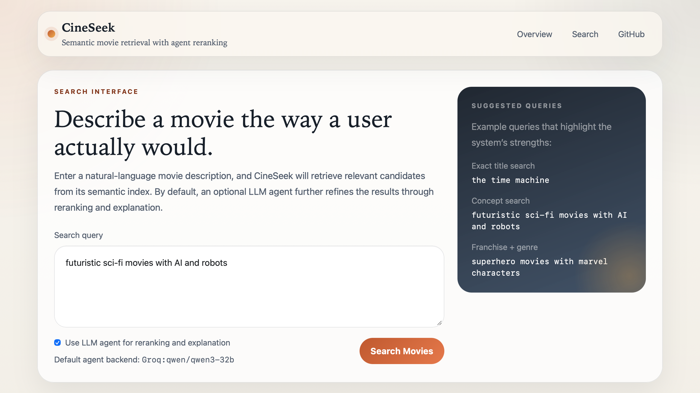
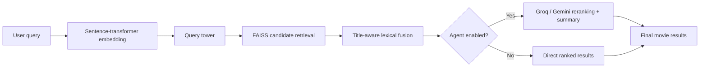

# **CineSeek**

🚀 **Live Demo:** [Try CineSeek](http://139.84.197.229:8000/search)
 💡 Try: *“sci-fi action movies about virtual reality”*

📦 **Docker Image:** ghcr.io/maxwellyin/cineseek-semantic-search

------

**CineSeek** is a semantic movie search system designed to demonstrate a full **retrieval engineering pipeline**, not just a prompt-based demo.

It maps real user-style movie queries to titles using a trained dual-tower retriever, serves candidates via FAISS, and optionally enhances results with an LLM-based agent for query rewriting, reranking, and explanation.

------

## **🚀 Highlights**

- **End-to-end retrieval system** (training → indexing → serving → UI)
- **Real search task** using MSRD query-to-movie relevance judgments
- **Dual-tower retriever** trained in PyTorch with cached embeddings
- **Low-latency ANN search** powered by FAISS
- **Agent layer** (LangChain + Groq / Gemini / Ollama / OpenAI)
- **Fully containerized deployment** via Docker + GHCR

------

## **🖼️ Interface Preview**



------

## **🎯 Why This Project Exists**

Most portfolio projects stop at vector search or a lightweight LLM wrapper.

CineSeek is built to demonstrate the **full retrieval loop**:

- training on a real search relevance dataset
- caching sentence-transformer embeddings for efficient iteration
- learning a lightweight retrieval head with PyTorch
- serving low-latency ANN search with FAISS
- layering an LLM agent **on top of retrieval (not replacing it)**

👉 The goal is to showcase **system design + modeling + deployment** in a single project.

------

## **🔍 What It Does**

- **Query-to-movie retrieval**
  - Trained on **MSRD (Movie Search Ranking Dataset)**
  - Maps real user queries → relevant movie titles
- **Dual-tower ranking**
  - Query tower encodes search intent
  - Item tower encodes movie metadata
- **Fast local serving**
  - FAISS retrieves candidates with low latency
- **Agent-enhanced search (optional)**
  - Query rewriting
  - Reranking top-k results
  - Natural language explanation

------

## **🏗️ Architecture**



------

## **⚙️ Tech Stack**

- **PyTorch** – dual-tower training
- **Sentence-Transformers** – embedding backbone
- **FAISS** – ANN retrieval
- **FastAPI + Jinja** – web interface
- **LangChain + Groq / Gemini / Ollama / OpenAI** – agent layer
- **Weights & Biases** – experiment tracking
- **Docker + GHCR** – deployment

------

## **📊 Dataset**

Uses **MSRD (Movie Search Ranking Dataset)**:

- ~28k real movie search queries
- 9,691 candidate movies in the indexed retrieval corpus
- crowd-labeled relevance judgments
- movie metadata from MovieLens + TMDB

👉 This aligns directly with the product task:

**query → relevant movie titles**

------

## **⚡ Quick Start (Local)**

```bash
python3 -m venv .venv
source .venv/bin/activate
pip install -r requirements.txt
```

Prepare data and train:

```bash
python -m flcr.data_processing.download_sentence_transformer
python -m flcr.data_processing.download_msrd
python -m flcr.data_processing.build_msrd_dataset
python -m flcr.train
env FLCR_DEVICE=cpu KMP_DUPLICATE_LIB_OK=TRUE python -m flcr.index
```

Run the app:

```bash
uvicorn apps.demo.app:app --reload
```

Open:

```
http://127.0.0.1:8000/search
```

Health check:

```bash
curl http://127.0.0.1:8000/health
```

------

## **🐳 Deployment (Docker + GHCR)**

This project is **production-oriented** and can be deployed on a low-cost VPS.

The container includes:

- processed dataset
- cached embeddings
- trained checkpoint
- FAISS index

### **Pull & Run**

```bash
docker pull ghcr.io/maxwellyin/cineseek-semantic-search:latest

docker run -d \
  -p 8000:8000 \
  --env-file .env \
  ghcr.io/maxwellyin/cineseek-semantic-search:latest
```

Then open:

```
http://<your-server-ip>:8000
```

------

### **Docker Compose (recommended)**

```bash
cp .env.example .env
# set GROQ_API_KEY

docker compose up -d
```

------

### **Build Locally**

```bash
docker buildx build --platform linux/amd64 -t cineseek-semantic-search .

docker run -p 8000:8000 \
  --env-file .env \
  cineseek-semantic-search
```

------

## **🔑 Environment Variables**

```bash
GROQ_API_KEY=...
FLCR_AGENT_PROVIDER=groq
FLCR_GROQ_MODEL=qwen/qwen3-32b
```

Optional:

```bash
GOOGLE_API_KEY=...
FLCR_AGENT_PROVIDER=gemini
FLCR_GEMINI_MODEL=gemini-2.5-flash-lite
FLCR_AGENT_PROVIDER=ollama
FLCR_OLLAMA_MODEL=qwen3:8b
FLCR_AGENT_PROVIDER=openai
OPENAI_API_KEY=...
```

------

## **📁 Project Layout**

```text
apps/demo/          FastAPI UI
flcr/train.py       training loop
flcr/model.py       dual-tower model
flcr/index.py       FAISS index builder
flcr/search.py      retrieval logic
flcr/agent/         LLM agent layer
flcr/data_processing/
```

------

## **🧠 Key Design Choices**

- Retrieval-first system (Agent as an enhancement layer)
- Cached embeddings for fast iteration
- Lightweight dual-tower for efficiency
- ANN retrieval for scalability
- Containerized deployment for reproducibility

------

## **📝 Notes**

- MSRD raw data is not redistributed
- Data is downloaded and processed locally
- Designed for **clarity + extensibility + deployment readiness**
