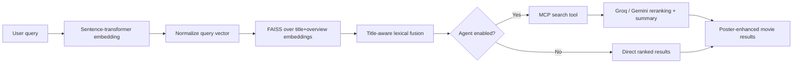

# **CineSeek**

🚀 **Live Demo:** [Try CineSeek](https://cineseek.maxwellyin.com/search)
 💡 Try: *“sci-fi action movies about virtual reality”*

📦 **Docker Image:** ghcr.io/maxwellyin/cineseek-semantic-search

------

**CineSeek** is a semantic movie search system designed to demonstrate a full **retrieval engineering pipeline**, not just a prompt-based demo.

It maps real user-style movie queries to titles using frozen sentence-transformer embeddings, serves candidates via FAISS, and optionally enhances results with an LLM-based agent for query rewriting, reranking, and explanation. The retrieval capability is also exposed as an **MCP-compatible search tool**, so the agent layer calls search through a protocol boundary rather than a hardwired local function. Retrieved movies are rendered with structured metadata and poster artwork for qualitative inspection.

------

## **🚀 Highlights**

- **End-to-end retrieval system** (data processing → embedding cache → indexing → serving → UI)
- **Real search task** using MSRD query-to-movie relevance judgments
- **Strong raw embedding baseline** selected through controlled retrieval evaluation
- **Low-latency ANN search** powered by FAISS
- **Agent layer** (LangChain + Groq / Gemini / Ollama / OpenAI)
- **MCP-exposed retrieval tool** for modular agent-to-search integration
- **Optional public MCP endpoint** secured with a bearer token for external clients
- **Poster-enhanced result UI** for easier qualitative evaluation
- **Fully containerized deployment** via Docker + GHCR
- **Release-based asset packaging** for reproducible model/index reuse without checking artifacts into git

------

## **🖼️ Interface Preview**


------

## **🎯 Why This Project Exists**

Most portfolio projects stop at vector search or a lightweight LLM wrapper.

CineSeek is built to demonstrate the **retrieval engineering loop**:

- auditing baselines on a real search relevance dataset
- caching sentence-transformer embeddings for efficient iteration
- selecting a strong frozen embedding representation instead of overfitting a small training set
- serving low-latency ANN search with FAISS
- layering an LLM agent **on top of retrieval (not replacing it)**
- exposing retrieval as a reusable **MCP search tool**

👉 The goal is to showcase **system design + modeling + deployment** in a single project.

------

## **🔍 What It Does**

- **Query-to-movie retrieval**
  - Evaluated on **MSRD (Movie Search Ranking Dataset)**
  - Maps real user queries → relevant movie titles
- **Raw embedding ranking**
  - Query text is encoded with a cached sentence-transformer model
  - Movie title and overview embeddings are fused and indexed
- **Fast local serving**
  - FAISS retrieves candidates with low latency
- **Agent-enhanced search (optional)**
  - Query rewriting
  - Reranking top-k results
  - Natural language explanation
  - Retrieval accessed through an MCP tool interface
- **Result presentation**
  - Movie posters
  - Plot overview
  - Genres, director, actors, and tags

------

## **🏗️ Architecture**



------

## **⚙️ Tech Stack**

- **Sentence-Transformers** – embedding backbone
- **PyTorch** – tensor processing and offline evaluation
- **FAISS** – ANN retrieval
- **FastAPI + Jinja** – web interface
- **LangChain MCP Adapters + FastMCP** – MCP tool layer
- **LangChain + Groq / Gemini / Ollama / OpenAI** – agent layer
- **Docker + GHCR** – deployment

------

## **📊 Dataset**

Uses **MSRD (Movie Search Ranking Dataset)**:

- ~28k real movie search queries
- 9,691 candidate movies in the indexed retrieval corpus
- crowd-labeled relevance judgments
- movie metadata from MovieLens + TMDB

👉 This aligns directly with the product task:

**query → relevant movie titles**

------

## **⚡ Quick Start (Local)**

```bash
python3 -m venv .venv
source .venv/bin/activate
pip install -r requirements.txt
```

Prepare data and build the raw embedding index:

```bash
python -m flcr.data_processing.download_sentence_transformer
python -m flcr.data_processing.download_msrd
python -m flcr.data_processing.build_msrd_dataset
env FLCR_DEVICE=cpu KMP_DUPLICATE_LIB_OK=TRUE python -m flcr.index
```

Run the app:

```bash
uvicorn apps.demo.app:app --reload
```

Open:

```
http://127.0.0.1:8000/search
```

Health check:

```bash
curl http://127.0.0.1:8000/health
```

------

## **🐳 Deployment (Docker + GHCR)**

This project is **production-oriented** and can be deployed on a low-cost VPS.

The container includes:

- processed dataset
- cached embeddings
- FAISS index
- current retriever checkpoints

The app also exposes:

- internal MCP tool endpoint for the built-in agent: `/agent-tools/mcp`
- optional public MCP endpoint for external clients: `/mcp/search/mcp`

### **Pull & Run**

```bash
docker pull ghcr.io/maxwellyin/cineseek-semantic-search:latest

docker run -d \
  -p 8000:8000 \
  --env-file .env \
  ghcr.io/maxwellyin/cineseek-semantic-search:latest
```

Then open:

```
https://cineseek.maxwellyin.com
```

In production, the Docker container serves FastAPI on port `8000` behind a reverse proxy and custom domain.

------

### **Docker Compose (recommended)**

```bash
cp .env.example .env
# set GROQ_API_KEY

docker compose up -d
```

### **Static Asset Release**

The processed dataset, sentence-transformer cache, FAISS index, and current
retriever checkpoints are packaged into a dedicated GitHub release asset:

- release tag: `assets-current`
- asset name: `cineseek-assets.tar.gz`

This keeps large retrieval artifacts out of git while still allowing Docker and
GitHub Actions builds to remain reproducible.

After retraining or rebuilding the index locally:

```bash
./scripts/publish_asset_release.sh
```

That refreshes the asset bundle used by:

- local `docker build`
- `docker compose build`
- GitHub Actions image builds

------

### **Build Locally**

```bash
docker buildx build --platform linux/amd64 -t cineseek-semantic-search .

docker run -p 8000:8000 \
  --env-file .env \
  cineseek-semantic-search
```

------

## **🔑 Environment Variables**

```bash
GROQ_API_KEY=...
FLCR_AGENT_PROVIDER=groq
FLCR_GROQ_MODEL=qwen/qwen3-32b
FLCR_PUBLIC_MCP_BEARER_TOKEN=replace_with_a_long_random_token
ASSET_BUNDLE_URL=https://github.com/maxwellyin/cineseek-semantic-search/releases/download/assets-current/cineseek-assets.tar.gz
```

Optional:

```bash
GOOGLE_API_KEY=...
FLCR_AGENT_PROVIDER=gemini
FLCR_GEMINI_MODEL=gemini-2.5-flash-lite
FLCR_AGENT_PROVIDER=ollama
FLCR_OLLAMA_MODEL=qwen3:8b
FLCR_AGENT_PROVIDER=openai
OPENAI_API_KEY=...
```

------

## **🔌 Public MCP Endpoint**

CineSeek can expose its retrieval engine as a public MCP-compatible tool endpoint over HTTPS.

- Internal agent endpoint:
  - `/agent-tools/mcp`
- Optional public endpoint for external MCP clients:
  - `/mcp/search/mcp`
- Public access is protected with:
  - `Authorization: Bearer <FLCR_PUBLIC_MCP_BEARER_TOKEN>`

The exposed tool is:

- `search_movies(query: str, k: int = 30)`

It returns compressed candidate results including:

- title
- year
- genres
- short overview
- top tags

Example MCP base URL in production:

```text
https://cineseek.maxwellyin.com/mcp/search/mcp
```

This allows the same semantic movie search capability to be used by:

- the built-in CineSeek agent layer
- external MCP clients
- future downstream apps or orchestration layers

------

## **📁 Project Layout**

```text
apps/demo/          FastAPI UI
apps/demo/search_mcp_server.py MCP search tool server
flcr/raw_retrieval.py raw embedding construction
flcr/index.py       FAISS index builder
flcr/search.py      retrieval logic
flcr/agent/         LLM agent layer
flcr/data_processing/
```

------

## **🧠 Key Design Choices**

- Retrieval-first system (Agent as an enhancement layer)
- Retrieval exposed as an MCP tool for modular orchestration
- Optional authenticated public MCP endpoint for external clients
- Cached embeddings for fast iteration
- Strong frozen baselines before adding trainable complexity
- ANN retrieval for scalability
- Containerized deployment for reproducibility

------

## **🧩 Portfolio Context**

CineSeek is the product-facing retrieval system in a three-part portfolio:

- **CineSeek**: deployed semantic movie search with FAISS, FastAPI, Docker, and optional LLM agent reranking
- **CineSeek-Adapters**: PyTorch ablation study for lightweight retrieval adaptation over frozen embeddings
- **CineSeek-MM**: multimodal text-image retrieval extension using CLIP-style embeddings and offline evaluation

This repo intentionally keeps the deployed demo simple and robust. Training-heavy experiments live in CineSeek-Adapters, while multimodal retrieval experiments live in CineSeek-MM.

------

## **📝 Notes**

- MSRD raw data is not redistributed
- Data is downloaded and processed locally
- Designed for **clarity + extensibility + deployment readiness**
